# Briefings

> An automated RSS feed summarization system powered by AI. Fetch articles from RSS feeds, generate daily summaries, and create weekly digest newsletters—all running on Cloudflare Workers.

## Features

- 📰 **RSS Feed Aggregation** - Automatically fetch articles from configured RSS feeds every 4 hours
- 🤖 **AI-Powered Summaries** - Generate daily summaries using Google Gemini (Flash model)
- 👤 **Personalized Briefings** - Recipient profiles for personalized voice and focus
- 📊 **Structured Summaries** - Daily summaries with sentiment analysis, topics, and entities
- 🎯 **Anti-Hallucination** - Strict constraints to prevent AI from fabricating stories
- 🔗 **URL Preservation** - Article URLs preserved through entire pipeline
- 🌡️ **Smart Temperature Tuning** - Optimized 0.7/0.85 temperatures for accuracy vs creativity
- 📧 **Weekly Digest Newsletter** - Compile weekly recaps with AI-generated insights (Gemini Pro model)
- ☁️ **Cloudflare Workers** - Serverless, edge-deployed with queue-based processing
- 💾 **D1 Database** - SQLite-based storage for articles, feeds, and summaries
- 📦 **R2 Storage** - Historical digest context for improved AI generation
- ✉️ **Email Delivery** - Optional Resend integration for automated newsletter sending

## Architecture

See [docs/architecture.mmd](docs/architecture.mmd) for the full system diagram.

**Architecture Overview:**

```mermaid
graph TB
    RSS[📡 RSS Feeds] -->|Fetch| Queue[📥 Queue]
    Queue -->|Parse| D1[(💾 D1 Database)]
    D1 -->|Daily| Flash[⚡ Gemini Flash<br/>0.7 temp]
    D1 -->|Weekly| Pro[🎯 Gemini Pro<br/>0.85 temp]
    Flash --> D1
    Pro --> R2[(📦 R2 Storage)]
    R2 --> Email[✉️ Email]
    
    Profile[👤 profile.yaml] -.->|Personalize| Pro
    Prompts[📝 prompts.yaml] -.->|Configure| Flash
    Prompts -.->|Configure| Pro
```



**Key Flow:** RSS → Queue → D1 → AI → Email

Personalization is configured via `config/profile.yaml` which is loaded at runtime to customize the newsletter voice and focus areas for each recipient.

### Queue Pipeline

| Queue | Consumer | Batch Size | Purpose |
|-------|----------|------------|---------|
| `briefings-feed-fetch` | `feed-fetch-consumer.ts` | 10 | Parse RSS feeds, store articles |
| `briefings-daily-summary-initiator` | `daily-summary-initiator.ts` | 1 | Find unprocessed articles, fan out |
| `briefings-daily-summary-processor` | `daily-summary-processor.ts` | 5 | Call Gemini API, save summaries |
| `briefings-weekly-digest` | `weekly-digest-consumer.ts` | 1 | Aggregate, generate digest, email |

### Scheduled Triggers

| Expression | Handler | Purpose |
|------------|---------|---------|
| `0 */4 * * *` | Feed fetch | Fetch all active RSS feeds every 4 hours |
| `0 10 * * *` | Daily summary | Generate summaries for yesterday at 10 AM UTC |
| `0 6 * * *` | Feed validation | Validate feed URLs are reachable |

### Key Components

#### Entry Point

`src/index.ts` exports three Cloudflare Worker handlers:

- **fetch** -- Hono HTTP routes under `/api/*`
- **scheduled** -- Cron jobs mapped by expression
- **queue** -- Queue messages dispatched by queue name

#### HTTP API

All routes under `/api` prefix. Authentication via `X-API-Key` header.

| Endpoint | Auth | Purpose |
|----------|------|---------|
| `GET /api/health` | None | Health check |
| `GET/POST /api/run/feed-fetch` | Required | Manual feed fetch |
| `GET/POST /api/run/daily-summary` | Required | Manual daily summary |
| `GET/POST /api/run/weekly-summary` | Required | Manual weekly digest |
| `POST /api/seed` | Required | Database seeding |
| `GET /api/test/previous-context` | Required | Dev testing |

#### Core Services

| Service | Location | Purpose |
|---------|----------|---------|
| Feed Service | `src/services/feed/feed-service.ts` | RSS parsing and article extraction |
| Summarization | `src/services/summarization/summarization-service.ts` | AI summary and digest generation |
| Gemini Client | `src/lib/gemini.ts` | Google Gemini API wrapper |
| Email | `src/lib/email.ts` | Resend integration for digest delivery |
| R2 Storage | `src/lib/r2.ts` | Historical digest storage for context |

#### AI Models

Configured in `src/lib/constants.ts`:

- **Daily summaries**: `gemini-3-flash-preview` (fast, efficient)
- **Weekly digests**: `gemini-3-pro-preview` (comprehensive analysis)

### Storage

#### D1 Database (Kysely ORM)

Schema defined in `src/db/types.ts`:

- `Feed` - RSS feed sources with validation state
- `Article` - Fetched articles with `processed` flag
- `DailySummary` - AI-generated daily summaries linked to feeds
- `WeeklySummary` - Weekly digest records with `sentAt` tracking
- `ArticleSummaryRelation` - Links articles to daily summaries
- `DailyWeeklySummaryRelation` - Links daily summaries to weekly summaries
- `PromptTemplate` - Customizable AI prompt storage

#### KV Namespace

`BRIEFINGS_CONFIG_KV` for feature flags and configuration.

#### R2 Bucket

`briefings_md_output` for storing digest history, used as context for future digests.

### Personalization

The personalization system tailors newsletter voice and focus areas based on recipient profiles. This creates a more engaging, personally relevant briefing experience.

**Configuration:**

Create a personalized profile by copying the example file:

```bash
cp config/profile.example.yaml config/profile.yaml
```

Edit `config/profile.yaml` with your preferences:

- **Background** - Professional experience and context
- **Expertise** - Areas of knowledge and skill
- **Interests** - Topics you want to focus on
- **Hot Takes** - Controversial opinions to shape voice
- **Companies Watching** - Organizations to track closely
- **Preferences** - Content length and detail level

**Privacy Note:** `config/profile.yaml` is gitignored by default to keep personal preferences private. Never commit your actual profile to version control.

The profile is loaded at build time and injected into AI prompts, customizing:
- Summary tone and voice
- Which stories get emphasized
- How technical explanations are pitched
- Topic prioritization in the weekly digest

### Structured Summaries

Daily summaries now include rich structured metadata beyond plain text:

**Schema Fields:**

| Field | Description | Example |
|-------|-------------|---------|
| `headline` | Catchy 2-5 word summary | "AI Red Flags Emerge" |
| `key_points` | 3-5 bullet points capturing main ideas | `["Point 1", "Point 2"]` |
| `sentiment_score` | -1.0 to 1.0 with breakdown | `{"overall": 0.6, "business": 0.8, ...}` |
| `topics` | Extracted topic tags | `["ai", "cloud", "security"]` |
| `entities` | Companies, people, products mentioned | `["OpenAI", "Satya Nadella"]` |
| `notable_quotes` | Memorable quotes with attribution | `["Quote text — Author"]` |
| `schema_version` | Version for future evolution | `1` |

**Sentiment Breakdown:**

The sentiment score ranges from -1 (very negative) to 1 (very positive) across multiple dimensions:

- **overall** - General sentiment of the story
- **business** - Impact on companies/industry
- **market** - Market reaction/implications
- **innovation** - Technology advancement sentiment
- **regulatory** - Policy/regulatory implications
- **social** - Social/public perception

**Benefits:**

- Better searchability and filtering
- Enables future features like sentiment-based filtering
- Structured data for analysis and visualization
- Preserved context through the entire pipeline

### Anti-Hallucination Features

Briefings implements multiple safeguards to prevent AI hallucination and ensure summaries accurately reflect source material:

**Temperature Reduction:**
- Reduced from 1.0 to 0.7-0.85 range
- Daily summaries: 0.7 (highly factual)
- Weekly digests: 0.85 (balanced creativity)
- Prevents temperature-induced fabrication

**Strict Prompt Constraints:**

Prompts include explicit guardrails:
- **"ONLY write about stories in the input"** - No external knowledge
- **"Do NOT make up or infer any details"** - Strict source adherence
- **Citations required** - Every claim must reference a source article

**URL Validation:**

- All citations must use exact URLs from source articles
- URLs are preserved through the entire pipeline
- No paraphrasing without attribution
- Links are verified before storage

**No Creative Synthesis:**

- Connections between stories must be explicitly stated in sources
- No invented narratives or trends
- No speculation beyond what sources provide
- Fact-grounded summaries only

**Result:** Summaries you can trust—factual, attributed, and grounded in real articles.

### Cloudflare Bindings

Defined in `src/types/env.d.ts`, configured in `wrangler.toml`:

- **DB**: D1 database
- **BRIEFINGS_CONFIG_KV**: KV namespace
- **briefings_md_output**: R2 bucket
- **Queues**: `FEED_FETCH_QUEUE`, `DAILY_SUMMARY_INITIATOR_QUEUE`, `DAILY_SUMMARY_PROCESSOR_QUEUE`, `WEEKLY_DIGEST_QUEUE`

### Security

- API key authentication on all mutating and operational endpoints
- Timing-safe key comparison to prevent timing attacks
- Secrets managed via Wrangler (`npx wrangler secret put`)
- No direct database exposure
- Input validation at all boundaries

### Technical Decisions

**Why Cloudflare Workers?**

- Edge deployment for global availability
- Integrated ecosystem (D1, KV, R2, Queues)
- Cost-effective for scheduled workloads
- Built-in scalability

**Why Queue-Based Architecture?**

- Resilience through retries
- Distributed processing within Worker CPU limits
- Clear separation of concerns
- Fan-out pattern for per-feed processing

**Why D1 + Kysely?**

- Native Workers integration
- SQLite compatibility
- Type-safe schema with Kysely ORM
- Cost-effective for read-heavy workloads

## Quick Start

### Prerequisites

- Node.js 20+
- pnpm 8+
- [Cloudflare account](https://dash.cloudflare.com/sign-up)
- [Google Gemini API key](https://aistudio.google.com/app/apikey)
- (Optional) [Resend account](https://resend.com) for email delivery

### Installation

```bash
# Clone the repository
git clone git@github.com:hirefrank/briefings.git
cd briefings

# Install dependencies
pnpm install

# Copy example files
cp wrangler.example.toml wrangler.toml
cp .env.example .env

# Edit .env and wrangler.toml with your values (see Configuration below)
```

### Configuration

#### 1. Create Cloudflare Resources

```bash
# Create D1 database
npx wrangler d1 create briefings-db
# Copy the database_id to wrangler.toml

# Create KV namespace
npx wrangler kv namespace create BRIEFINGS_CONFIG_KV
# Copy the id to wrangler.toml

# Create R2 bucket
npx wrangler r2 bucket create briefings-md-output
```

#### 2. Update wrangler.toml

Edit `wrangler.toml` and replace:
- `account_id` - Your Cloudflare account ID
- `database_id` - D1 database ID from step 1
- `id` (KV namespace) - KV namespace ID from step 1

#### 3. Set Environment Variables

Edit `.env` with your values:

```bash
# ============================================================================
# REQUIRED
# ============================================================================

# Google Gemini API Key (required for AI summarization)
# Get your key at: https://aistudio.google.com/app/apikey
GEMINI_API_KEY=your-gemini-api-key-here

# API Key for HTTP endpoint authentication (required)
# All POST /api/run/* endpoints require this header: X-API-Key: your-api-key
API_KEY=your-secure-api-key-min-16-chars

# ============================================================================
# OPTIONAL - Email Delivery
# ============================================================================

# Resend API Key (for weekly digest emails)
# RESEND_API_KEY=re_your_api_key_here

# Email From Address (must be verified domain in Resend)
# EMAIL_FROM=briefings@yourdomain.com

# Email To Address (comma-separated for multiple recipients)
# EMAIL_TO=you@example.com,team@example.com

# Email Subject Prefix (default: [Briefings])
# EMAIL_SUBJECT_PREFIX=[Briefings]

# ============================================================================
# OPTIONAL - Development
# ============================================================================

# Environment (development | staging | production)
# Affects auth behavior - development mode skips auth if no key set
# ENVIRONMENT=production

# Log Level (debug, info, warn, error)
# LOG_LEVEL=info
```

#### 4. Set Cloudflare Secrets

For production, set secrets via Wrangler (more secure than `.env`):

```bash
# Required: Gemini API key for AI summarization
echo "your-gemini-api-key" | npx wrangler secret put GEMINI_API_KEY

# Required: API key for HTTP endpoint authentication
# Generate a secure key (minimum 16 characters recommended)
API_KEY="briefings-$(openssl rand -hex 16)"
echo "$API_KEY" | npx wrangler secret put API_KEY
# Save this key - you'll need it for all API requests via X-API-Key header

# Optional: Resend API key for email delivery
# echo "re_your_key" | npx wrangler secret put RESEND_API_KEY
```

**Important:** Save your `API_KEY` somewhere secure (password manager). You'll need it to trigger manual operations via the HTTP API.

**Note:** Non-sensitive vars like `EMAIL_FROM`, `EMAIL_TO`, `EMAIL_SUBJECT_PREFIX`, `ENVIRONMENT`, and `LOG_LEVEL` can be set in `wrangler.toml [vars]` section instead.

### Database Setup

```bash
# Apply migrations to remote D1
pnpm run db:migrate

# Copy example configs (edit with your own settings)
cp config/feeds.example.yaml config/feeds.yaml
cp config/prompts.example.yaml config/prompts.yaml
cp config/profile.example.yaml config/profile.yaml

# Sync feeds from YAML to D1 (bidirectional sync)
pnpm sync:feeds
```

### Deploy

```bash
# First-time setup: Create queues (run once)
npx wrangler queues create briefings-feed-fetch
npx wrangler queues create briefings-daily-summary-initiator
npx wrangler queues create briefings-daily-summary-processor
npx wrangler queues create briefings-weekly-digest

# Deploy to Cloudflare Workers
pnpm run deploy

# Verify deployment
curl https://your-worker.workers.dev/health
```

## API Authentication

All mutating and operational HTTP endpoints require authentication via the `X-API-Key` header.

### Setting Up API Key

1. Generate a secure API key (minimum 16 characters recommended)
2. Set it as a Cloudflare secret:
   ```bash
   echo "your-secure-api-key" | npx wrangler secret put API_KEY
   ```

### Using API Key

Include the key in all POST requests to `/api/run/*` endpoints:

```bash
curl -X POST https://your-worker.workers.dev/api/run/feed-fetch \
  -H "X-API-Key: your-api-key"
```

### Development Mode

If `ENVIRONMENT=development` and no `API_KEY` is configured, the middleware will log a warning but allow requests. This is useful for local testing but **never use in production**.

## Usage

### Adding RSS Feeds

Edit `config/feeds.yaml` to add your feeds, then sync to D1:

```bash
# Edit config/feeds.yaml with your feeds
pnpm sync:feeds
```

Or add feeds directly to the D1 database using the Cloudflare dashboard or CLI:

```bash
npx wrangler d1 execute DB --remote --command="INSERT INTO Feed (id, name, url, isActive) VALUES (...)"
```

### Manual Triggers

Use the CLI trigger command (automatically reads API_KEY from `.env`):

```bash
# Fetch all feeds
pnpm trigger feed-fetch

# Generate daily summary for yesterday (or specific date)
pnpm trigger daily-summary
pnpm trigger daily-summary 2025-01-28

# Generate weekly digest for last Sunday (or specific date)
pnpm trigger weekly-summary
pnpm trigger weekly-summary 2025-01-26
```

Or use curl directly with your API key:

```bash
# Fetch all feeds
curl -X POST https://your-worker.workers.dev/api/run/feed-fetch \
  -H "X-API-Key: your-api-key"

# Generate daily summary
curl -X POST https://your-worker.workers.dev/api/run/daily-summary \
  -H "X-API-Key: your-api-key" \
  -H "Content-Type: application/json" \
  -d '{"date": "2025-01-18"}'

# Generate weekly digest
curl -X POST https://your-worker.workers.dev/api/run/weekly-summary \
  -H "X-API-Key: your-api-key" \
  -H "Content-Type: application/json" \
  -d '{"weekEndDate": "2025-01-19"}'
```

### Automated Schedule

The system runs automatically via cron triggers (configured in `wrangler.toml`):

| Job | Cron | ET Time | Purpose |
|-----|------|---------|---------|
| **Feed Fetch** | `0 */4 * * *` | Every 4 hours | Fetch articles from all active RSS feeds |
| **Daily Summary** | `0 10 * * *` | 5:00 AM ET | Generate AI summaries for yesterday's articles |
| **Feed Validation** | `0 6 * * *` | 1:00 AM ET | Validate feed URLs are reachable |
| **Weekly Digest** | `0 13 * * 0` | 8:00 AM ET Sunday | Generate weekly recap and send email |

**Note on ET times:** Eastern Time varies between EST (UTC-5) and EDT (UTC-4) depending on daylight saving time. The cron schedules use UTC, so:
- **Winter (EST)**: Daily summaries run at 5:00 AM ET
- **Summer (EDT)**: Daily summaries run at 6:00 AM ET

### Week Definition

A week is defined as **Monday through Sunday** (7 days). The weekly digest:
- Runs every Sunday at 8:00 AM ET
- Summarizes the previous Monday through Sunday
- Requires all daily summaries to be complete before running

### Manual Weekly Digest Operations

**Generate weekly digest for current week:**
```bash
# Trigger via HTTP API (uses current week: Monday to today)
curl -X POST https://your-worker.workers.dev/api/run/weekly-summary \
  -H "X-API-Key: your-api-key"
```

**Generate for a specific week:**
```bash
# Specify exact date range
curl -X POST https://your-worker.workers.dev/api/run/weekly-summary \
  -H "X-API-Key: your-api-key" \
  -H "Content-Type: application/json" \
  -d '{
    "weekStartDate": "2025-01-13",
    "weekEndDate": "2025-01-19"
  }'
```

**Force regeneration (if already exists):**
```bash
curl -X POST https://your-worker.workers.dev/api/run/weekly-summary \
  -H "X-API-Key: your-api-key" \
  -H "Content-Type: application/json" \
  -d '{
    "weekEndDate": "2025-01-19",
    "force": true
  }'
```

**Check weekly digest status:**
```bash
curl -X GET https://your-worker.workers.dev/api/run/weekly-summary \
  -H "X-API-Key: your-api-key"
```

## Local Development

```bash
# Start dev server (connects to remote Cloudflare resources)
pnpm run dev

# Run type checking
pnpm run typecheck

# Run tests
pnpm run test
```

### Database Management

Database is hosted on Cloudflare D1. Use Wrangler to interact with it:

```bash
# Apply migrations to remote D1
pnpm run db:migrate

# Sync feeds from YAML to database
pnpm sync:feeds

# View database in browser (requires browser login)
npx wrangler d1 execute DB --remote --command="SELECT * FROM Feed LIMIT 10"
```

## Email Delivery (Optional)

To enable weekly digest emails via Resend:

1. Sign up for [Resend](https://resend.com)
2. Verify your sending domain
3. Get your API key
4. Set environment variables:

```bash
# In wrangler.toml [vars] section
EMAIL_FROM = "briefings@yourdomain.com"
EMAIL_TO = "you@example.com,team@example.com"  # comma-separated
EMAIL_SUBJECT_PREFIX = "[Briefings]"  # Optional - prefix for email subjects

# As Cloudflare secret
echo "your-resend-api-key" | npx wrangler secret put RESEND_API_KEY
```

**Email Subject Customization:**

The `EMAIL_SUBJECT_PREFIX` variable lets you brand your weekly digest emails:

| Setting | Result | Use Case |
|---------|--------|----------|
| `[Briefings]` (default) | `[Briefings] 🥩 AI Red Flags, Cloud Wars...` | Professional branding |
| `🥩 The Beef` | `🥩 The Beef AI Red Flags, Cloud Wars...` | Casual/fun branding |
| `[Your Company]` | `[Your Company] 🥩 AI Red Flags...` | Corporate deployment |
| (empty string) | `🥩 AI Red Flags, Cloud Wars...` | No prefix |

Weekly digests will automatically be sent when generated. The `sentAt` timestamp is tracked in the database.

## AI Models

Briefings uses Google Gemini with model selection based on task complexity:

- **Daily Summaries**: `gemini-3-flash-preview` (fast, efficient for short summaries)
- **Topic Extraction**: `gemini-3-flash-preview` (quick analysis)
- **Title Generation**: `gemini-3-flash-preview` (creative titles)
- **Weekly Digest**: `gemini-3-pro-preview` (comprehensive analysis, better synthesis)

Models are configured in `src/lib/constants.ts`.

## Database Schema

Core tables:

- `Feed` - RSS feed sources
- `Article` - Fetched articles
- `DailySummary` - AI-generated daily summaries
- `WeeklySummary` - AI-generated weekly digests
- `ArticleSummaryRelation` - Many-to-many: articles ↔ daily summaries
- `DailyWeeklySummaryRelation` - Many-to-many: daily ↔ weekly summaries
- `PromptTemplate` - AI prompt templates

See `src/db/types.ts` for TypeScript types and `migrations/` for SQL schema.

## Prompts

AI prompts are loaded from `config/prompts.yaml` at build time:

- `daily-summary` - Template for daily article summaries
- `weekly-digest` - Template for weekly newsletter
- `topic-extraction` - Extract topics from content
- `title-generator` - Generate newsletter titles

Customize these prompts in `config/prompts.yaml` to match your newsletter style. Templates use Mustache-style `{{variable}}` substitution. See `config/prompts.example.yaml` for the full template format.

## Personalization Profile

The personalization profile (`config/profile.yaml`) customizes newsletter voice and content focus:

```yaml
profile:
  background: "Product manager at a B2B SaaS company"
  expertise: ["Product strategy", "AI/ML", "SaaS metrics"]
  interests: ["AI agents", "Developer tools", "Product-led growth"]
  hot_takes: ["Most AI demos are just prompt engineering"]
  companies: ["OpenAI", "Stripe", "Linear"]
  preferences:
    content_length: "medium"
    technical_depth: "high"
```

Copy from `config/profile.example.yaml` and customize for your preferences. The file is gitignored for privacy—never commit your actual profile.

## Monitoring

```bash
# View real-time logs
pnpm run tail

# Check queue metrics
# Visit: Cloudflare Dashboard > Queues

# Check D1 database
npx wrangler d1 execute DB --remote --command="SELECT COUNT(*) FROM Feed"
```

## Troubleshooting

### Build Issues

```bash
# Clear node_modules and reinstall
rm -rf node_modules pnpm-lock.yaml
pnpm install

# Regenerate types
pnpm run typecheck
```

### Queue Issues

If queues aren't processing:
1. Check Cloudflare Dashboard > Queues for backlogs
2. Verify queue consumers are deployed
3. Check logs with `pnpm run tail`

### Database Issues

```bash
# Check migrations status
npx wrangler d1 migrations list DB

# Force re-apply migrations
pnpm run db:migrate
```

## Project Structure

```
briefings/
├── src/
│   ├── db/              # Database schema (Kysely ORM)
│   ├── lib/             # Core utilities (logger, errors, prompts, email)
│   ├── services/        # Business logic (feeds, summarization)
│   ├── server-functions/
│   │   ├── crons/       # Cron job handlers
│   │   ├── http/        # HTTP endpoint handlers
│   │   └── queues/      # Queue consumers
│   ├── scripts/         # Database seeding, migrations
│   ├── types/           # TypeScript types
│   └── index.ts         # Worker entry point
├── migrations/          # Database migrations
├── wrangler.toml        # Cloudflare Workers config
├── package.json
└── README.md
```

## Popular Use Cases

Briefings is flexible and can be customized for various newsletter and digest scenarios:

### 1. Substack Digest

Create a daily or weekly digest of your favorite Substack newsletters:

- Aggregate multiple Substack feeds into one curated newsletter
- AI-generated summaries help readers quickly scan content
- Weekly compilation creates a "best of" roundup

**Example feeds:**
- Industry thought leaders' Substacks
- Niche newsletters in your area of interest
- Competitor analysis feeds

### 2. Industry News Digest

Stay informed about your industry without spending hours reading:

- Tech, finance, healthcare, energy, aviation—any industry
- Automatic categorization by feed source
- AI-extracted key insights and trends

**Example feeds:**
- Trade publications (TechCrunch, VentureBeat, Aviation Week)
- Company blogs and press releases
- Regulatory/government feeds

### 3. Competitive Intelligence

Monitor competitors and market movements:

- Track competitor announcements and blog posts
- Monitor news coverage and industry analysis
- Weekly summaries highlight strategic shifts

### 4. Research & Development Tracker

Keep up with academic and technical research:

- arXiv, MIT Technology Review, Interesting Engineering
- Automatic topic extraction and categorization
- Build a searchable archive of key developments

### 5. Investment Research

Create investment thesis digests:

- Track sector-specific news and analysis
- Monitor earnings calls and executive communications
- Weekly synthesis of market-moving developments

### 6. Personal Knowledge Base

Build your own AI-curated reading list:

- Curate feeds from your areas of interest
- Daily summaries help you stay current
- Weekly digests create a monthly archive

### Customization Tips

- **Categories**: Group feeds by topic for better organization
- **Prompts**: Customize AI prompts in `src/lib/prompts.ts` for your voice
- **Frequency**: Adjust cron schedules for daily vs. weekly digest
- **Email**: Configure Resend for automated delivery to your inbox

## Future Ideas

A few directions that could extend Briefings beyond RSS but never made it off the backlog:

- **Non-RSS web content** -- Many valuable sources don't publish feeds. A scraping or extraction layer (using headless browsers or readability parsers) could ingest arbitrary web pages, newsletters delivered to a catch-all inbox, or content behind paywalls with authenticated sessions.
- **SaaS and productivity tool integrations** -- A lot of signal lives inside tools people already use: Google Docs, Notion databases, Slack channels, Linear/Jira updates, Confluence wikis, and similar. Connectors for these sources would let Briefings summarize internal knowledge alongside public content, turning it into a true "everything digest" rather than an RSS-only tool.

Both would benefit from a pluggable source adapter pattern so new integrations could be added without touching the core summarization pipeline.

## Contributing

This is an open-source project. Contributions welcome!

1. Fork the repository
2. Create a feature branch (`git checkout -b feature/amazing-feature`)
3. Commit your changes (`git commit -m 'Add amazing feature'`)
4. Push to the branch (`git push origin feature/amazing-feature`)
5. Open a Pull Request

## License

MIT License - see [LICENSE](LICENSE) file for details.

## Acknowledgments

- Built with [Cloudflare Workers](https://workers.cloudflare.com/)
- AI powered by [Google Gemini](https://ai.google.dev/)
- Email delivery via [Resend](https://resend.com)
- Database by [Kysely ORM](https://github.com/kysely-org/kysely)
