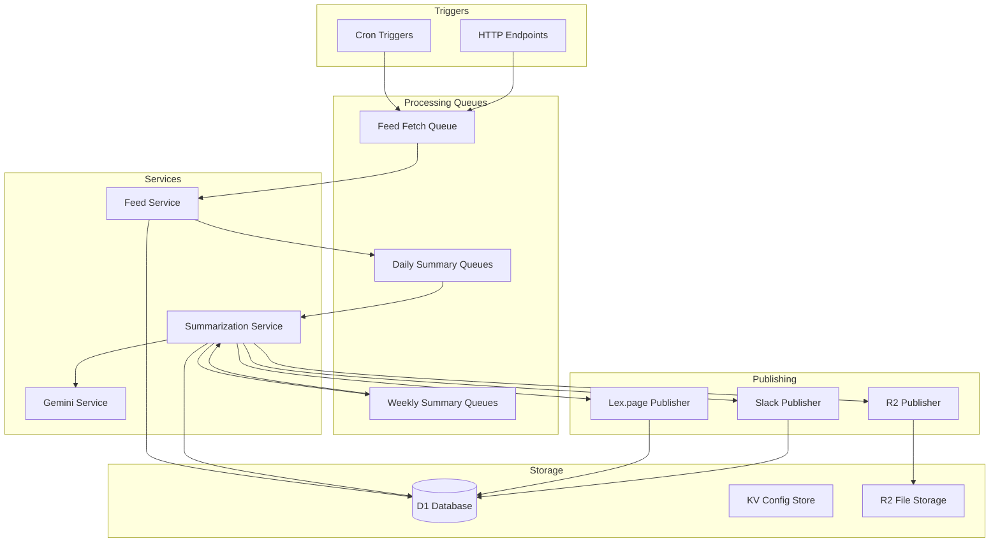

# Briefings Architecture

## Overview

Briefings is an automated RSS feed summarization system deployed on Cloudflare
Workers. It fetches articles from configured RSS feeds, generates AI-powered
daily summaries using Google Gemini, and creates weekly recap newsletters.

## System Architecture

## Key Components

### 1. Triggers

- **Cron Jobs**:
  - Feed fetch: Every 4 hours
  - Daily summary: 5 AM EST daily
  - Weekly summary instances: Every 30 minutes (checks for scheduled instances)
- **HTTP Endpoints**: Manual triggers for all operations

### 2. Queue Architecture

Total of 11 queues for distributed processing:

- **Feed Processing**: `feed-fetch`
- **Daily Summaries**: `daily-summary-initiator`, `daily-summary-processor`
- **Weekly Summaries**: 5 queues for multi-stage processing
- **Publishing**: `lexpage-publish`, `slack-publish`, `r2-publish`

### 3. Services

- **Feed Service**: RSS parsing with custom parser
- **Summarization Service**: Orchestrates AI summary generation
- **Gemini Service**: Interfaces with Google's Gemini AI
- **Publishing Services**: Lex.page, Slack, and R2 storage

### 4. Storage

- **D1 Database**: Articles, summaries, and relationships
- **KV Namespace**: Feed configurations and prompts
- **R2 Bucket**: Generated markdown files

## Data Flow

1. **Feed Fetching**

   - Cron trigger initiates feed fetch
   - RSS feeds parsed and articles extracted
   - New articles stored in D1 database
   - Daily summary queue triggered

2. **Daily Summary Generation**

   - Articles grouped by feed and date
   - AI generates summary using Gemini
   - Summary stored in database
   - Publishing queues triggered

3. **Weekly Summary Generation**

   - Multi-stage process across 5 queues
   - Aggregates daily summaries
   - Generates "Beef" titles for engagement
   - Final summary published

4. **Publishing**
   - Parallel publishing to multiple channels
   - Lex.page for web viewing
   - Slack for notifications
   - R2 for archival

## Technical Decisions

### Why Cloudflare Workers?

- Edge deployment for global availability
- Integrated ecosystem (D1, KV, R2, Queues)
- Cost-effective for scheduled workloads
- Built-in scalability

### Why Queue-Based Architecture?

- Resilience through retries
- Distributed processing
- Timeout management (30s Worker limit)
- Clear separation of concerns

### Why D1 Database?

- Native integration with Workers
- SQLite compatibility
- Cost-effective for our scale
- Good performance for read-heavy workloads

## Performance Considerations

- **Queue Batch Sizes**: Optimized per queue type
- **Retry Logic**: 3-5 retries with exponential backoff
- **Timeout Management**: 30-60s per queue consumer
- **Caching**: KV for configuration, reduces database reads

## Error Handling

- Rich error context with `ApiError` classes
- Structured logging throughout
- Queue retry mechanisms
- Graceful degradation for publishing failures

## Security

- API key authentication for HTTP endpoints
- Secrets managed via Wrangler
- No direct database exposure
- Input validation at all boundaries

## Monitoring

- Cloudflare Analytics for Worker metrics
- Structured logging with context
- Queue depth monitoring
- Error tracking and alerting

## Future Enhancements

- See specs/ directory for planned features:
  - Article clustering
  - Enhanced content extraction
  - Structured JSON output
  - Previous context for summaries
